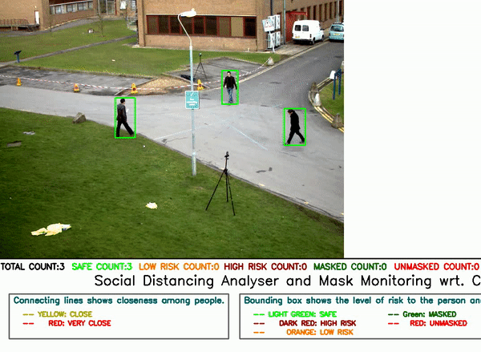

# Live Social Distance Monitoring and Face Mask Detection AI Solution for Covid-19

## Tata Innoverse Solver Hunt 8 Hackathon

### This project proposes a computer vision based AI system to check whether social distancing is being maintained in crowded place or at any place (eg: market, or workplace) coupled with Mask detection system to track people who are wearing masks. This solution can be used in CCTV cameras and other video surveillance systems. While the data; such as the number of people in the vicinity, the number of people violating social distancing, and not wearing face-masks; has been used for analysis.

 
 
 

  
  
  

  

  

  
  
  
  
  

# Project Overview
Our AI Compliance consists of state-of-the-Art Social Distancing Monitoring coupled with Mask detection system to check whether the norms are followed or not. This project aims at monitoring people violating Social Distancing over video footage coming from CCTV Cameras. Uses YOLOv3-ssp for detecting persons along with social distancing analyser tool simulated with 3D depth factor based on the camera position and orientation for recognizing potential intruders. A Face Mask Classifier model (ResNet50) is trained and deployed for identifying people not wearing a face mask.
